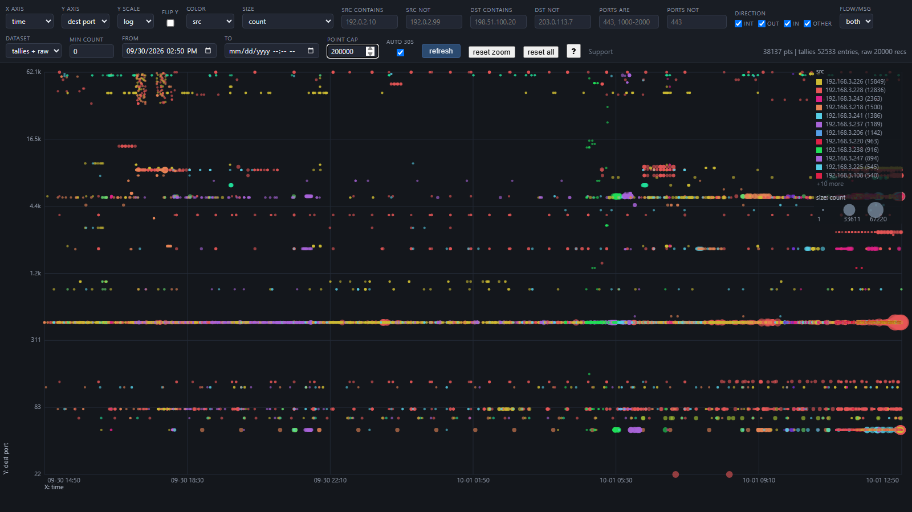
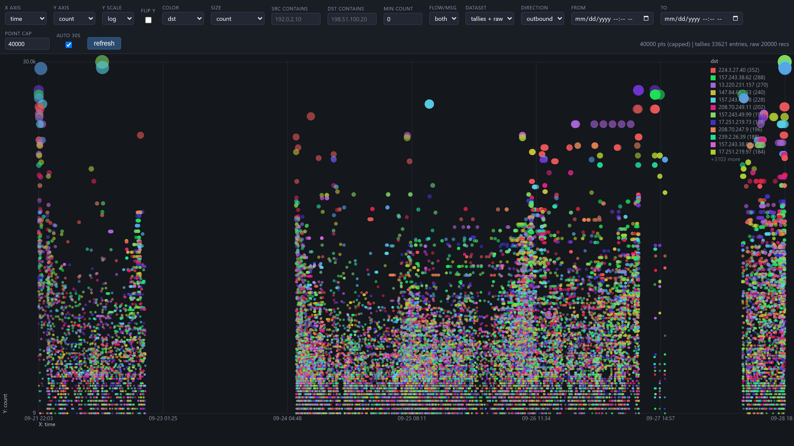
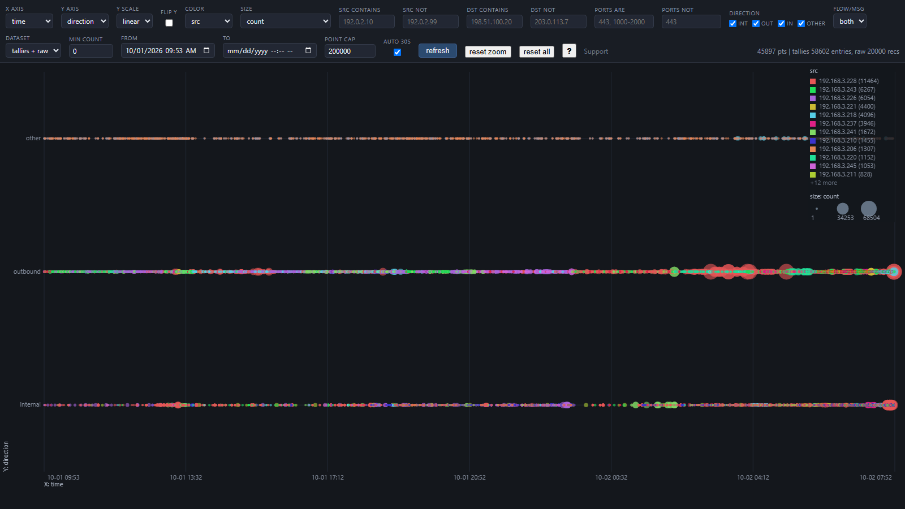
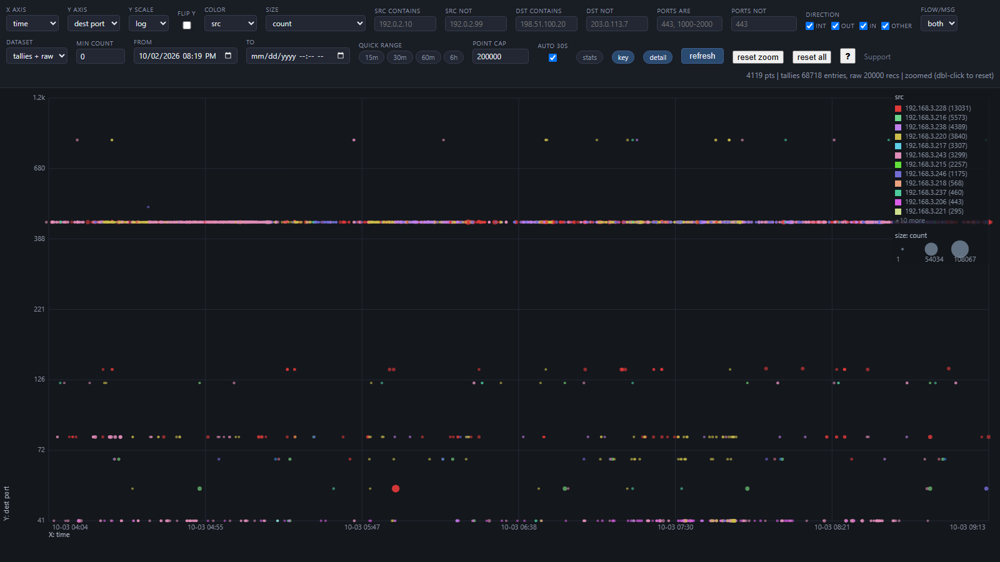
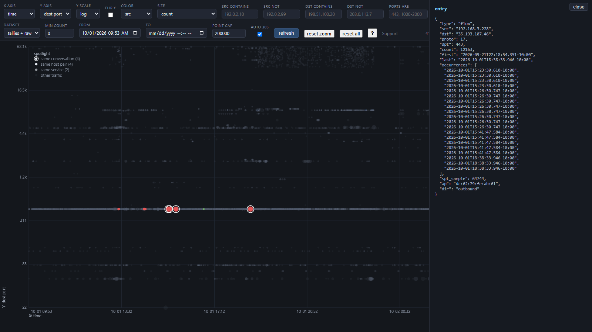

# Omada Logger & Viz

**A zero-dependency Windows syslog receiver, condenser, and real-time
visualizer for TP-Link Omada firewalls and gateways** (ER8411 and friends) -
a free *syslog server for Windows*: if you've been looking for a way to
collect and view Omada firewall logs without a Linux box or a paid product,
this is it.

Point your Omada device's remote logging at this PC and it will:

- **Record every event** to a raw log (UDP 514, RFC 3164/5424-compatible
  payloads, capped at 50 MB with automatic oldest-first trimming)
- **Condense the flood into tallies** - flows deduplicate to
  `(src, dst, proto, dest port)` counts, repeated alerts fold into message
  templates, each tally keeps first/last seen + the 20 most recent
  occurrence timestamps (own 50 MB cap, survives restarts)
- **Show your traffic in real time** in a browser: interactive
  time-series scatterplot with swappable X/Y axes, color and size
  encodings, log scale, and RFC1918 direction slicing
  (internal / outbound / inbound / other)
- **Heal itself**: boot-start scheduled task (no console window), crash
  recovery with exactly-once replay, and a watchdog that restarts the
  receiver if the log ever goes stale

Zero pip installs - pure Python 3 stdlib and vanilla JS.

## Screenshots











*Captured from a live deployment (~40k rendered points, a full day of traffic);
addresses sanitized.*

## Requirements

- Windows 10/11 (or Server) with **Python 3.8+** on PATH (`python.exe` /
  `pythonw.exe`)
- An Omada gateway/firewall with remote (syslog) logging - UDP 514
- One UAC approval during install

## Quickstart

```powershell
git clone https://github.com/Treystu/Omada-Logger-Viz.git
cd Omada-Logger-Viz
.\install.ps1        # UAC prompt: firewall rule + boot task + watchdog
```

Then, on the Omada device (e.g. ER8411 web UI): **System Tools → System
Log → Log Settings** - enable remote logging and point it at this PC's LAN
IP, port **514** (UDP). Omada remote logging is UDP-only; that's all this
listens on.

Watch it live - double-click the **Omada Viz** desktop shortcut (created by
`install.ps1`), or:

```powershell
.\viz.ps1                   # starts the server if needed, opens the browser
.\viz.ps1 -Stop             # stops it
```

Tail the raw log:

```powershell
Get-Content "$env:LOCALAPPDATA\OmadaSyslog\firewall.log" -Tail 20 -Wait
```

## How it works

```
Omada ER8411 ──UDP 514──►  omada_syslog.py (Task Scheduler, boot-start)
                             │
                             ├─► firewall.log      raw lines, 50 MB ring
                             │                     (receive-time + sender + raw payload)
                             └─► condensed.json    tallies (flows + msg templates)
                                                   50 MB cap, atomic 60 s flushes
                                                   exactly-once crash recovery

python omada_viz.py ──► browser :8780   scatterplot of tallies + raw tail
                                        (read-only, localhost, zero deps)
```

- The receiver splits Omada's multi-record datagrams (CR/LF packed) into
  one log line per record, each re-prefixed with receive time + source IP -
  attribution can't be forged by crafted payloads. NULs stripped.
- The condenser runs **inside** the receiver process: every record folds
  into tallies at ingestion time (microseconds each, failure-armored so
  ingestion is never affected). Tallies survive restarts; on startup the
  receiver folds any un-tallied raw lines exactly once.
- Logs are trimmed atomically (temp file + `os.replace`): when the file
  exceeds its cap, the newest ~90% is always kept, oldest lines roll off.
- Nothing is installed machine-wide except the firewall port rule; the
  scheduled task runs as your user (S4U - starts with Windows whether
  you're logged on or not).

## Files

| File | Purpose |
|---|---|
| `omada_syslog.py` | The receiver (pure Python 3 stdlib, no pip installs) |
| `install.ps1` | One-time setup: firewall rule + boot task + watchdog (self-elevates) |
| `uninstall.ps1` | Removes tasks + firewall rule (keeps log data) |
| `watchdog.ps1` | Auto-restarts the receiver if the raw log goes stale (every 5 min) |
| `omada_condenser.py` | Tallies engine (used by the receiver; `--replay`/`--status` CLI) |
| `condensed_view.py` | Query tool for the condensed tallies |
| `syslog_parser.py` | Offline pretty-printer / filter for the raw log |
| `omada_viz.py` + `viz.html` | On-demand web UI: interactive scatterplot of tallies + raw tail |
| `viz.ps1` | One-click launcher: starts the viz (if needed) + opens the browser; `-Stop` stops it |
| `test_receiver.py` | Integration tests (safe: high ports + temp files, 30+ checks) |

## Configuration

All settings are command-line flags with sane defaults. To change them
permanently: `uninstall.ps1`, then `install.ps1 -TaskArgs '--...'`.

| Flag | Default | Meaning |
|---|---|---|
| `--bind` | `0.0.0.0` | Local address to listen on |
| `--port` | `514` | UDP port |
| `--allow` | `192.168.0.0/24` | Authorized senders (repeatable; IP or CIDR; `0.0.0.0/0` = everyone) |
| `--log-file` | `%LOCALAPPDATA%\OmadaSyslog\firewall.log` | Raw log path |
| `--max-mb` | `50` | Raw log size cap before trimming |
| `--keep-pct` | `90` | Fraction of cap kept after a trim |
| `--condense-file` | `%LOCALAPPDATA%\OmadaSyslog\condensed.json` | Tallies file |
| `--condense-max-mb` | `50` | Condensed-store size cap (stalest tallies evicted first) |
| `--condense-every` | `60` | Seconds between tally flushes |
| `--condense-max-keys` | `100000` | Hard bound on distinct tally keys in RAM |
| `--occurrences` | `20` | Recent duplicate-occurrence timestamps per tally |
| `--no-condense` | off | Disable condensation (raw log only) |
| `--verbose` | off | Console echo (manual runs / debugging) |

If your LAN uses a different subnet (e.g. `192.168.1.0/24`), pass
`--allow` accordingly - the installer's firewall rule also needs to match
(see Notes below).

## Querying and filtering

```powershell
python syslog_parser.py                    # pretty-print all (fac.sev labels)
python syslog_parser.py --sev err          # only err or worse
python syslog_parser.py --text "attack" -n 50

python condensed_view.py                   # top 20 tallies by count
python condensed_view.py --src 192.168.0.10 --dst 1.1.1.1
python condensed_view.py --type msg --stale 7     # events dormant 7+ days
python condensed_view.py --meta                   # store header
python omada_condenser.py --status                # summary + top tallies
python omada_condenser.py --replay                # manual fold of raw backlog
```

Stop the receiver before `--replay`: a running receiver holds tallies in
memory and overwrites the file on its next flush.

## Visualizing (web UI)

On-demand, read-only, localhost-only, zero dependencies:

```powershell
python omada_viz.py          # then open http://localhost:8780
```

Or just double-click the desktop shortcut / run `.\viz.ps1` (starts the
server headless if needed, then opens the page; `.\viz.ps1 -Stop` stops it).

Prefer always-on? `.\install.ps1 -VizBoot` registers a boot task so the
dashboard is permanently available at http://localhost:8780 - the idle
server costs a few MB of RAM; the only real work is building the data
payload when a browser asks for it.

Interactive time-series scatterplot of the condensed tallies (long-term)
plus the raw-log tail (fine-grained; last 20k records, `--raw-tail` to
change):

- **X / Y axes** (each swappable): time, first seen, last seen, count, src,
  dst, dest port, proto, severity, flow/msg, dataset, direction
- **Y scale**: linear or log (numeric axes), plus a **flip Y** toggle to
  reverse the axis direction
- **Brush zoom**: drag a rectangle on the chart to zoom into any region
  (dense clusters become readable); double-click, Esc, or the "reset zoom"
  button zooms back out. Zoom holds across auto-refreshes. Thin horizontal
  or vertical bands zoom just the axis they span.
- **Pattern spotlight**: click any dot to grey the noise and pop its related
  traffic — same conversation (white-ringed), same host pair, same service
  — making patterns visible at a glance. Esc or an empty click clears it.
- **Color-key drilldown**: click a legend entry (an IP, a port, a severity)
  to filter the entire view to that value. Click it again to remove it.
- **Scoped stats panel**: unique counts (sources, destinations, ports,
  flows, protocols), per-entry totals, and direction breakdown with
  proportional bars — all reflecting whatever you've spotlighted, zoomed
  into, or drilled down to.
- **Color / point size**: src, dst, port, proto, severity, dataset,
  direction, or count (blue-to-red gradient, log-scaled for even spread).
  Size also offers **per-group aggregates** — e.g. "distinct ports per
  group" sizes each dot by how many different services its device talks to
  (grouping follows the color variable, then the categorical axis). Records
  and flows per group act as traffic-quantity proxies — Omada's remote log
  doesn't include byte or packet totals.
- **Precise filtering**: src/dst smart IP matching (single IPs, ranges
  `192.168.0.100-200`, shorthand lists `192.168.0.1,2,3,6-10,12`, CIDR
  `10.0.0.0/8`), dest-port include/exclude lists with ranges, RFC1918
  direction checkboxes in any combination, flow vs msg, dataset, min count,
  time range + quick-range buttons (15m/30m/60m/6h), point cap — plus a
  one-click "reset all".
- **32-color palette** with re-rank on filter changes — the top 12 visible
  categories always get distinct, evenly-spread colors
- **Legend + drawer visibility toggles**: persistent "key" and "detail"
  buttons hide/show each panel independently
- **Built-in help**: hover any control for a one-line explanation, or hit
  the "?" button for the full how-to guide.
- Hover for a summary; click a point for the full tally entry.
- Auto-refreshes every 30 s without disturbing the view (colors and zoom
  stay stable; time windows slide). Ctrl+C (or close the window) to stop.
  `--host 0.0.0.0` if you ever want to view it from the LAN.

Defaults open as X = time, Y = dest port, color = src, size = count -
"who's been talking to which services, when, and how much".

## Watchdog (auto-restart)

A scheduled task (`Omada Syslog Watchdog`, every 5 min, elevated) checks the
raw log's freshness: if nothing has been written for 10+ minutes (hung
process, e.g. after machine sleep), it waits a 90 s grace period, re-checks,
then restarts the receiver task. At most one forced restart per 30 min
cooldown, so a genuinely quiet network cannot cause churn. Restarts are
safe: the receiver folds any un-tallied raw lines exactly once on startup.

## Tests

```powershell
python test_receiver.py
```

Runs the receiver + condenser + viz through 30+ integration checks on a
high port with temp files - ingestion, allowlist, multi-record splitting,
trimming, dedup, restart persistence, eviction, failure armor, replay
markers, and the viz API.

## Uninstall

```powershell
.\uninstall.ps1
```

Removes both scheduled tasks and the firewall rule. Log data at
`%LOCALAPPDATA%\OmadaSyslog` is kept (delete it manually if you want a
clean slate).

## Troubleshooting

- **No data arriving?** Check the ER8411's remote-log target is this PC's
  *current* LAN IP (`ipconfig`) - a DHCP lease change silently orphans the
  stream. A DHCP reservation fixes it for good. Also confirm the receiver
  task is Running (`Get-ScheduledTask -TaskName 'Omada Syslog Receiver'`).
- **Port 514 already bound?** Another syslog service may have claimed it.
  The receiver refuses to share the port (deliberate); stop the other one.
- **Viz won't start?** The default port is 8780 - if taken, use
  `--port 8790`. The server refuses to share ports too.
- **Log stops growing after sleep?** The watchdog restarts the receiver
  within ~15 minutes; give the machine's network a moment to re-associate.
- **Trim not shrinking the log?** A viewer (Excel, `Get-Content -Wait`)
  holding the log open pauses trimming; close it and the next cycle trims.

## Notes & caveats

- **Trim = data loss by design**: anything past the 50 MB window is gone.
  Adjust `--max-mb` if you need a longer window.
- Don't keep the log open in Excel or other locking apps while the receiver
  runs - a locked file pauses trimming (resumes when released; the file may
  temporarily exceed the cap).
- The installer adds a Windows Firewall rule scoped to inbound UDP 514 from
  192.168.0.0/24 (Private/Domain profiles). If you change `--allow` to a
  different subnet, adjust the firewall rule to match.
- Local tail: `Get-Content -Wait` holds a lock and can block trims while it
  runs; close it when finished.
- Everything is scoped to the current user (task identity and log data). The
  one machine-wide piece is the firewall port rule, which only admits
  inbound UDP 514 from the LAN subnet.

## Support

This is free and always will be. If it saved you a syslog-server license or a
Linux VM and you want to chip in, contributions go directly to the author.

[PayPal](https://www.paypal.me/LBallek) &middot; [Venmo — @lucas-ballek](https://venmo.com/u/lucas-ballek) &middot; [Cash App — $luball](https://cash.app/$luball)

Contributions are voluntary gifts to an individual, not payment for a
service, and are not tax-deductible. They buy nothing: no priority support,
no warranties, no promises about future features.

## License

[MIT](LICENSE) - use it, fork it, ship it.
